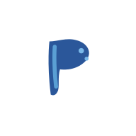
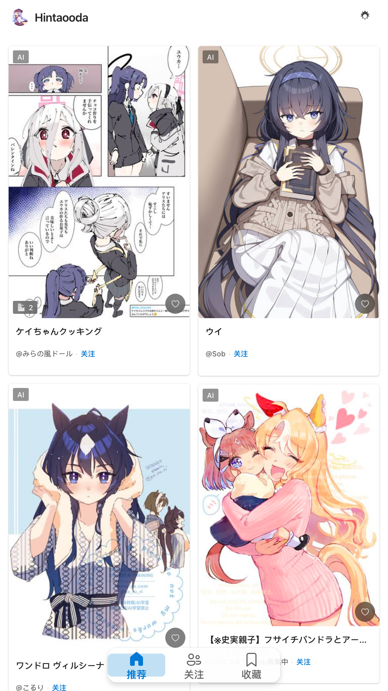
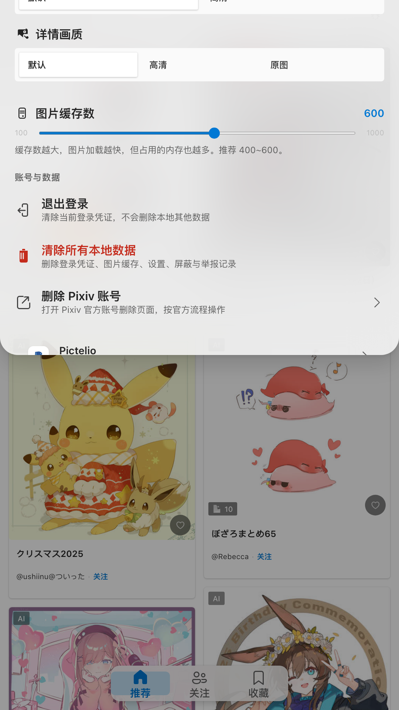
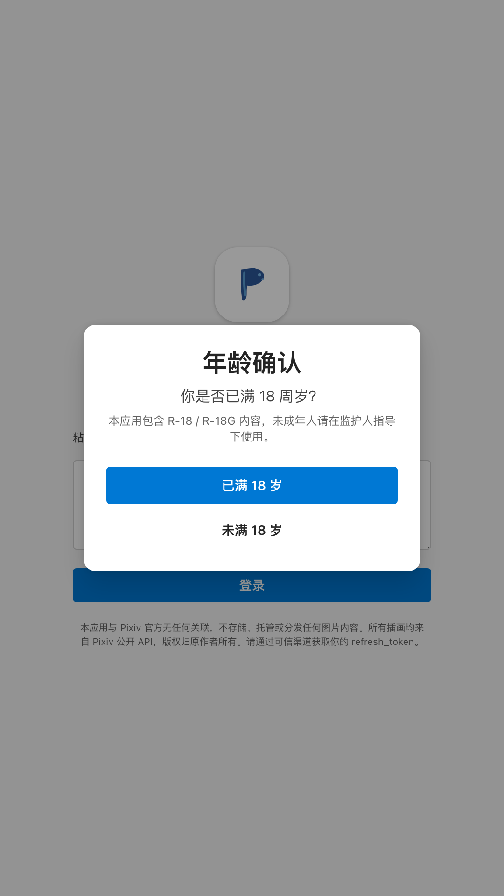

<div align="center">
  
  <h1 align="center">Pictelio</h1>
  <p align="center">
    <strong>A third-party Pixiv illustration browser built with SolidJS</strong>
    <br>
    Packaged as a native Android app with Capacitor
  </p>
  <p align="center">
    <a href="https://github.com/a1121611810/pixivizer/blob/main/LICENSE">
      
    </a>
    
    
    
    
    
    <br>
    
  </p>
  <p>
    🌐 <b>English</b> · <a href="#中文">中文</a>
  </p>
</div>

---

<a id="中文"></a>

<details>
  <summary><strong>中文</strong> — 点击查看中文版本</summary>

  <div align="center">
    
    <h2>Pictelio</h2>
    <p>基于 SolidJS 的第三方 Pixiv 插画浏览器，通过 Capacitor 打包为 Android 原生应用</p>
  </div>

### 📸 预览

  <div align="center">
    <table>
      <tr>
        <td align="center"><strong>推荐流</strong></td>
        <td align="center"><strong>作品详情</strong></td>
        <td align="center"><strong>设置面板</strong></td>
        <td align="center"><strong>登录页</strong></td>
      </tr>
      <tr>
        <td></td>
        <td></td>
        <td></td>
        <td></td>
      </tr>
    </table>
  </div>

### ✨ 功能特性

| 🎨 浏览体验                                                     | 🔧 实用功能                                          | 📱 原生优化                                      |
| :-------------------------------------------------------------- | :--------------------------------------------------- | :----------------------------------------------- |
| **推荐插画流** `/recommended` — 发现精选作品                    | **收藏管理** `/bookmarks` — 管理你的收藏             | **返回键处理** — Android 原生返回统一处理        |
| **关注动态流** `/following` — 追踪关注的画师                    | **个人中心** `/me` — 个人主页与设置                  | **底部导航栏** — 符合直觉的多 Tab 切换           |
| **作品详情页** `/illust/:id` — 大图、多页、Ugoira 动图          | **用户主页** `/user/:id` — 浏览画师作品集            | **下拉刷新** — 滑动到顶继续下拉触发              |
| **用户作品页** `/user/:id/illusts` — 画师全部作品               | **关注/取消关注** — 在卡片上直接操作                 | **自动隐藏导航** — 沉浸式浏览体验                |
| **瀑布流/单列/网格** — 三种布局模式切换                         | **举报与屏蔽** — 管理不想看到的内容                  | **安全存储** — Android Keystore 加密 token       |
| **年龄确认与 R18 过滤** — 首次启动确认，内容分级显示            | **检查更新** — 通过 GitHub Releases 获取新版本       | **PWA 离线缓存** — Service Worker 缓存图片与资源 |

### 🛠️ 技术栈

| 类别             | 技术                                                                  |   版本 |
| :--------------- | :-------------------------------------------------------------------- | -----: |
| **框架**         | [SolidJS](https://www.solidjs.com/)                                   | 1.9.13 |
| **路由**         | [@tanstack/solid-router](https://github.com/TanStack/router)            | 1.170.17 |
| **构建工具**     | [vite-plus](https://github.com/asonkeri/vite-plus)（封装 Vite）       |  0.2.1 |
| **打包工具**     | [Vite](https://vite.dev/)                                             |  8.1.0 |
| **样式引擎**     | [UnoCSS](https://unocss.dev/)                                         | 66.7.3 |
| **设计语言**     | [Microsoft Fluent Design System 2](https://fluent2.microsoft.design/) |      — |
| **移动端运行时** | [Capacitor](https://capacitorjs.com/)                                 |  8.4.0 |
| **类型系统**     | [TypeScript](https://www.typescriptlang.org/) (strict 模式)           |  6.0.3 |
| **测试**         | [Vitest](https://vitest.dev/)                                         |  4.1.9 |
| **包管理器**     | [pnpm](https://pnpm.io/)                                              | 11.9.0 |

### 📁 项目结构

这是一个 pnpm workspace  monorepo：

```text
pixivizer/
├── packages/
│   ├── app/                     # pictelio-app — SolidJS SPA 主体
│   │   ├── src/
│   │   │   ├── api/             # Pixiv API 层 (auth, client, illust, user, types)
│   │   │   ├── components/      # 可复用 UI 组件
│   │   │   ├── primitives/      # 底层逻辑单元（虚拟滚动、瀑布流计算、Web Worker）
│   │   │   ├── routes/          # 页面组件
│   │   │   ├── services/        # 服务封装 (pixiv, updateService)
│   │   │   ├── stores/          # SolidJS 响应式状态管理
│   │   │   ├── styles/          # CSS 分层 (reset.css, tokens.css, base.css)
│   │   │   ├── types/           # 环境类型声明
│   │   │   ├── utils/           # 工具函数 (imageLoader, secureStorage, r18Filter...)
│   │   │   ├── App.tsx          # 应用根组件
│   │   │   └── main.tsx         # 应用入口
│   │   ├── android/             # Capacitor Android 原生项目
│   │   ├── scripts/             # 构建/发布/Android 开发脚本
│   │   └── package.json
│   └── website/                 # pictelio-website — VitePress 落地页
│       ├── docs/
│       └── package.json
├── scripts/
├── docs/                        # 项目文档
├── dist/                        # Vite 构建输出
└── package.json                 # workspace 委托层
```

### 🚀 快速开始

**环境要求：** [Node.js](https://nodejs.org/) 18+、[pnpm](https://pnpm.io/) 11.9.0、Android 构建需要 [Android Studio](https://developer.android.com/studio)、JDK 17、Android SDK

> **⚠️ Android 平台要求：** 应用最低兼容 **Android 11.0（API 30）**，且需要 **WebView ≥ 85**。低于 Android 11 的设备无法安装，WebView 版本不足时启动会显示升级提示。详见 `docs/platform-compatibility.md`。

```bash
# 安装依赖
pnpm install

# 启动 Vite 开发服务器
pnpm dev
```

> **代理配置：** Web 开发阶段通过 Vite 代理访问 Pixiv。项目自动读取 `https_proxy`、`HTTPS_PROXY`、`http_proxy`、`HTTP_PROXY` 环境变量，默认回退到 `http://127.0.0.1:10808`。
>
> ```bash
> https_proxy=http://127.0.0.1:7890 pnpm dev
> ```

### 📱 Android 构建与开发

**编译 Debug APK：** `pnpm build:android` — 依次执行版本同步、TypeScript 检查、Vite 构建、Capacitor 同步、Gradle 编译。

**一键开发热重载：** `pnpm dev:android` — 自动启动 Vite、获取 Wi-Fi IP、同步配置、编译安装。

**常用命令：** `pnpm cap:sync` 同步 Web 产物 · `pnpm cap:copy` 仅复制产物 · `pnpm cap:open:android` 打开 Android Studio

### 🔐 登录说明

应用使用 iOS OAuth 凭证策略与 Pixiv 服务器通信。支持 **refresh_token** 粘贴登录或 **用户名/密码** 直接登录。登录成功后 `refresh_token` 通过 `capacitor-secure-storage-plugin` 加密存储（Android Keystore），并会从旧的 `@capacitor/preferences` 自动迁移一次。

### 🎨 设计规范

强制遵循 **Microsoft Fluent Design System 2**：

- 颜色、间距、圆角、阴影使用 CSS 变量，禁止硬编码
- 动画曲线仅允许 decelerate / standard / accelerate / linear
- 动画时长仅允许 100ms、150ms、200ms、300ms、500ms
- 所有可交互元素覆盖 hover、active、focus-visible 状态
- 最小触控目标 40×40px

### 📜 可用脚本

| 命令                      | 说明                                              |
| :------------------------ | ------------------------------------------------- |
| `pnpm dev`                | 启动 Vite 开发服务器                              |
| `pnpm build`              | TypeScript 检查 + Vite 构建到 `dist/`             |
| `pnpm check`              | 仅 TypeScript 类型检查                            |
| `pnpm preview`            | 预览生产构建                                      |
| `pnpm test`               | 运行 Vitest 测试                                  |
| `pnpm test:watch`         | Vitest watch 模式                                 |
| `pnpm lint`               | oxlint 代码检查                                   |
| `pnpm fmt`                | oxfmt 代码格式化                                  |
| `pnpm fmt:check`          | oxfmt 格式检查（不修改）                          |
| `pnpm build:android`      | 构建 Web + Capacitor 同步 + Gradle 编译 Debug APK |
| `pnpm build:android:release` | 构建签名 Release APK（需签名环境变量）         |
| `pnpm dev:android`        | 一键启动 Android 开发热重载流程                   |
| `pnpm cap:sync`           | 同步 Web 产物和 Capacitor 配置到 Android 项目     |
| `pnpm cap:copy`           | 仅复制 Web 产物到 Android（不更新 Capacitor 配置）|
| `pnpm cap:open:android`   | 在 Android Studio 中打开 `android/` 项目          |
| `pnpm release:github`     | 构建 Release APK 并发布到 GitHub Releases         |
| `pnpm release`            | 完整发布流程                                      |
| `pnpm release:dry`        | 发布流程干跑                                      |
| `pnpm deploy`             | 本地预览部署 landing 页面到 `_site/`              |
| `pnpm deploy:dry`         | 部署干跑                                          |

### ⚠️ 免责声明

本应用**仅供学习与研究目的**使用。

- Pictelio **与 Pixiv Inc. 没有任何关联**，未经 Pixiv 官方认可或授权。
- 应用中展示的所有插画均来自 [Pixiv](https://www.pixiv.net) 公开 API，版权归原作者所有。
- 本项目**不存储、托管、分发或修改**任何受版权保护的内容。它仅作为第三方客户端，检索 Pixiv 公开 API 中已有的数据。
- 用户有责任遵守 Pixiv 的[服务条款](https://www.pixiv.net/terms/)及适用法律。
- **请在 24 小时内删除本应用及相关数据**，除非你获得版权所有者的明确许可。

使用本软件即表示你已阅读并理解此免责声明。如不同意，请勿使用或分发本项目。

### 📄 许可证

[](LICENSE) © 2026

---

[↑ 回到 English](#)

</details>

---

## 📸 Screenshots

<div align="center">
  <table>
    <tr>
      <td align="center"><strong>Feed</strong></td>
      <td align="center"><strong>Detail</strong></td>
      <td align="center"><strong>Settings</strong></td>
      <td align="center"><strong>Login</strong></td>
    </tr>
    <tr>
      <td></td>
      <td></td>
      <td></td>
      <td></td>
    </tr>
  </table>
</div>

---

## ✨ Features

<div align="center">

| 🎨 Browsing                                                                               | 🔧 Utilities                                                  | 📱 Native                                                            |
| :---------------------------------------------------------------------------------------- | :------------------------------------------------------------ | :------------------------------------------------------------------- |
| **Recommended Feed** `/recommended` — Curated illustrations from Pixiv                    | **Bookmarks** `/bookmarks` — Your saved illusts               | **Predictive Back Gesture** — Android native transition animation    |
| **Following Feed** `/following` — Illusts from artists you follow                         | **Profile** `/me` — Personal page and settings                | **Bottom Navigation Bar** — Multi-tab navigation                     |
| **Illust Detail** `/illust/:id` — Full resolution, multi-page, Ugoira playback            | **User Page** `/user/:id` — Browse an artist's portfolio      | **Pull to Refresh** — Swipe down to reload                           |
| **User Illusts** `/user/:id/illusts` — All works by an artist                             | **Follow / Unfollow** — Directly from image cards             | **Auto-hide Navigation** — Scroll-based nav bar hiding               |
| **Waterfall / Single Column / Grid** — Three layout modes                                 | **Report & Block** — Manage unwanted content                  | **Secure Storage** — Android Keystore encrypted token                |
| **Age Confirmation & R18 Filter** — First-launch gate with content filtering              | **Update Check** — Get new versions via GitHub Releases       | **PWA Offline Cache** — Service Worker caches images & assets        |

</div>

---

## 🛠️ Tech Stack

| Category            | Technology                                                            |  Version |
| :------------------ | :-------------------------------------------------------------------- | -------: |
| **Framework**       | [SolidJS](https://www.solidjs.com/)                                   |   1.9.13 |
| **Routing**         | [@tanstack/solid-router](https://github.com/TanStack/router)            |   1.170.17 |
| **Build Tool**      | [vite-plus](https://github.com/asonkeri/vite-plus) (wraps Vite)       |    0.2.1 |
| **Bundler**         | [Vite](https://vite.dev/)                                             |    8.1.0 |
| **Styling Engine**  | [UnoCSS](https://unocss.dev/)                                         |   66.7.3 |
| **Design Language** | [Microsoft Fluent Design System 2](https://fluent2.microsoft.design/) |        — |
| **Mobile Runtime**  | [Capacitor](https://capacitorjs.com/)                                 |    8.4.0 |
| **Type System**     | [TypeScript](https://www.typescriptlang.org/) (strict mode)           |    6.0.3 |
| **Testing**         | [Vitest](https://vitest.dev/)                                         |    4.1.9 |
| **Package Manager** | [pnpm](https://pnpm.io/)                                              |   11.9.0 |

---

## 📁 Project Structure

This is a pnpm workspace monorepo:

```text
pixivizer/
├── packages/
│   ├── app/                     # pictelio-app — SolidJS SPA core
│   │   ├── src/
│   │   │   ├── api/             # Pixiv API layer (auth, client, illust, user, types)
│   │   │   ├── components/      # Reusable UI components
│   │   │   ├── primitives/      # Low-level logic (virtual scroll, masonry, Web Worker)
│   │   │   ├── routes/          # Page components
│   │   │   ├── services/        # Service layer (pixiv, updateService)
│   │   │   ├── stores/          # SolidJS reactive state management
│   │   │   ├── styles/          # CSS layers (reset.css, tokens.css, base.css)
│   │   │   ├── types/           # Ambient type declarations
│   │   │   ├── utils/           # Utility functions (imageLoader, secureStorage, r18Filter...)
│   │   │   ├── App.tsx          # Root app component
│   │   │   └── main.tsx         # App entry point
│   │   ├── android/             # Capacitor Android native project
│   │   ├── scripts/             # Build/release/Android dev scripts
│   │   └── package.json
│   └── website/                 # pictelio-website — VitePress landing page
│       ├── docs/
│       └── package.json
├── scripts/
├── docs/                        # Project docs
├── dist/                        # Vite build output
└── package.json                 # Workspace delegation layer
```

---

## 🚀 Quick Start

### Prerequisites

- [Node.js](https://nodejs.org/) 18+
- [pnpm](https://pnpm.io/) 11.9.0
- Android builds require: [Android Studio](https://developer.android.com/studio), JDK 17, Android SDK, `ANDROID_HOME` env var

> **⚠️ Android Platform Requirements:** The app targets **Android 11.0 (API 30)** minimum and requires **WebView ≥ 85**. Devices below Android 11 cannot install the APK. If the WebView version is too old, the app shows an upgrade prompt on launch. See `docs/platform-compatibility.md` for details.

### Install dependencies

```bash
pnpm install
```

### Start the dev server

```bash
pnpm dev
```

> **Proxy Configuration**: During web development, Vite proxies requests to Pixiv. The project reads `https_proxy`, `HTTPS_PROXY`, `http_proxy`, and `HTTP_PROXY` environment variables. Falls back to `http://127.0.0.1:10808` if none are set.
>
> Example:
>
> ```bash
> https_proxy=http://127.0.0.1:7890 pnpm dev
> ```

---

## 📱 Android Build & Development

### Build a Debug APK

```bash
pnpm build:android
```

This runs: version sync → TypeScript type check → Vite production build → Capacitor sync → `./gradlew assembleDebug`

### Build a Release APK

```bash
pnpm build:android:release
```

Requires signing environment variables `PICTELIO_KEYSTORE_PASSWORD` and `PICTELIO_KEY_PASSWORD`. See `docs/release-signing.md` for details.

### Hot-reload development

```bash
pnpm dev:android
```

Starts the Vite dev server, detects the local Wi-Fi IP, syncs Capacitor configuration, builds the APK, and installs it via adb automatically.

**Prerequisites**: Phone and computer on same Wi-Fi, adb device connected, dependencies installed.

### Capacitor commands

| Command                 | Description                                           |
| :---------------------- | ----------------------------------------------------- |
| `pnpm cap:sync`         | Sync web assets & Capacitor config to Android         |
| `pnpm cap:copy`         | Copy web assets to native platform (no config update) |
| `pnpm cap:open:android` | Open Android project in Android Studio                |

---

## 🔐 Authentication

The app uses iOS OAuth credential strategy to communicate with Pixiv servers.

| Method                | Description                                                     |
| :-------------------- | --------------------------------------------------------------- |
| **refresh_token**     | Paste a token obtained from other trusted sources               |
| **Username/Password** | Enter your Pixiv credentials; the app obtains a token via OAuth |

Once logged in, the `refresh_token` is encrypted and persisted via `capacitor-secure-storage-plugin` (Android Keystore). It is also automatically migrated once from the legacy `@capacitor/preferences` storage on first launch.

---

## 🎨 Design Guidelines

This project enforces **Microsoft Fluent Design System 2**:

- **Colors & Spacing** — Use CSS variables from `src/styles/tokens.css`; no hardcoded values
- **Animation Curves** — Only `cubic-bezier(0,0,0,1)` decelerate, `cubic-bezier(0.33,0,0.67,1)` standard, `cubic-bezier(0.33,0,0,1)` accelerate, `linear`
- **Animation Duration** — Only 100ms, 150ms, 200ms, 300ms, 500ms
- **Interaction States** — All interactive elements must cover `hover`, `active`, `focus-visible`
- **Touch Targets** — Minimum 40×40px

---

## 📜 Available Scripts

| Command                     | Description                                              |
| :-------------------------- | -------------------------------------------------------- |
| `pnpm dev`                  | Start Vite dev server                                    |
| `pnpm build`                | TypeScript check + Vite build to `dist/`                 |
| `pnpm check`                | TypeScript type-check only                               |
| `pnpm preview`              | Preview production build                                 |
| `pnpm test`                 | Run Vitest tests                                         |
| `pnpm test:watch`           | Run tests in watch mode                                  |
| `pnpm lint`                 | Run oxlint                                               |
| `pnpm fmt`                  | Run oxfmt formatter (write)                              |
| `pnpm fmt:check`            | Run oxfmt formatter (check only)                         |
| `pnpm build:android`        | Web build + Capacitor sync + Gradle Debug APK            |
| `pnpm build:android:release`| Build signed Release APK (requires signing env vars)     |
| `pnpm dev:android`          | Hot-reload Android development workflow                  |
| `pnpm cap:sync`             | Sync web assets & Capacitor config to Android            |
| `pnpm cap:copy`             | Copy web assets to native platform (no config update)    |
| `pnpm cap:open:android`     | Open Android project in Android Studio                   |
| `pnpm release:github`       | Build Release APK and publish to GitHub Releases         |
| `pnpm release`              | Full release workflow                                    |
| `pnpm release:dry`          | Release workflow dry-run                                 |
| `pnpm deploy`               | Preview deploy landing page to `_site/`                  |
| `pnpm deploy:dry`           | Deploy dry-run                                           |

---

## ⚠️ Disclaimer

This project is provided **for educational and research purposes only**.

- Pictelio is **not affiliated with**, endorsed by, or connected to Pixiv Inc. in any way.
- All illustrations displayed in the app are sourced from the [Pixiv](https://www.pixiv.net) public API and are the intellectual property of their respective creators.
- This project does **not** store, host, distribute, or modify any copyrighted content. It acts solely as a third-party client that retrieves data already accessible through Pixiv's public API.
- Users are responsible for complying with Pixiv's [Terms of Service](https://www.pixiv.net/terms/) and applicable laws.
- **Delete the app and all associated data within 24 hours** if you do not have explicit permission from the copyright holders to view their content through this client.

By using this software, you acknowledge that you have read and understood this disclaimer. If you do not agree, do not use or distribute this project.

## 📄 License

[](LICENSE) © 2026
